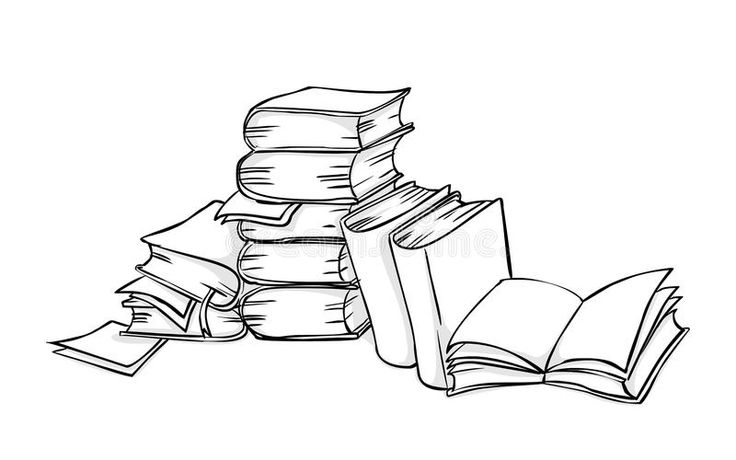
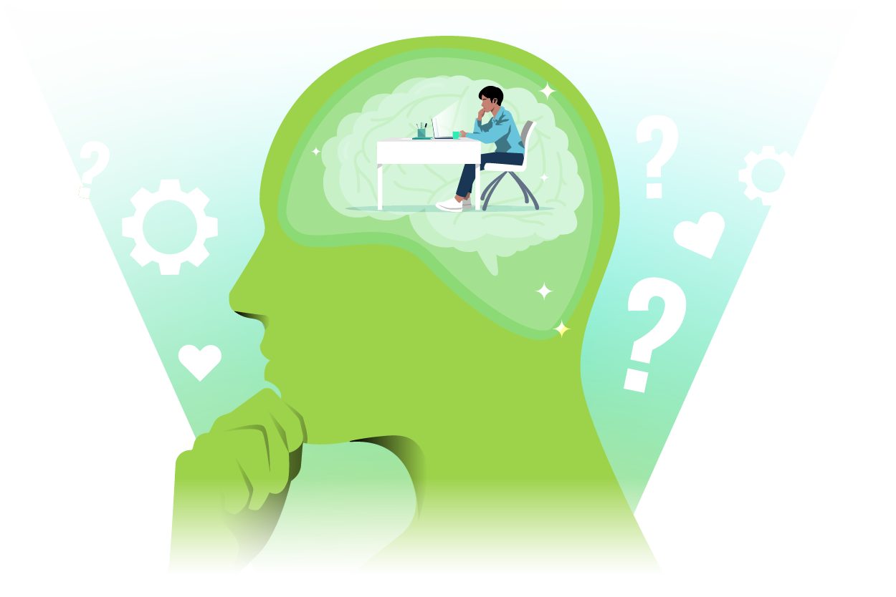

# Preparing for the Modern Workforce Beyond a Degree

Professor Yadava emphasized:

> **A degree is only the ground floor (foundation). Curiosity and creativity are the ceiling (true height of success).**

A degree may open the door to opportunities, but continuous learning, curiosity, and innovation determine long-term growth.

---

## 1. Degree vs. Employability

* A degree helps you enter the professional world.
* To succeed beyond that, you need:

  * Curiosity
  * Creativity
  * Problem-solving skills
  * Practical application of knowledge

The purpose of these internship interactions is to help students become **employable graduates**, not just degree holders.

---

## 2. The Changing Economy

### Earlier: Knowledge-Based Economy

  

* Success depended on how much information a person could memorize.
* Education and competitive exams focused heavily on rote learning.
* Students often forgot the memorized information after exams.

### Today: Curiosity & Creativity-Based Economy

  

* Information is available to everyone through the internet and AI.
* Competitive advantage comes from:

  * Understanding concepts
  * Asking better questions
  * Applying knowledge creatively
  * Solving real-world problems

---

## 3. Information is Available to Everyone

The instructor explained that today:

* Knowledge is no longer scarce.
* Even the information available to great scientists is now accessible online.

What matters is:

* How you use information.
* How creatively you apply it.
* How you generate new ideas.

---

## 4. AI as a Learning Tool

Students should use AI platforms such as:

* ChatGPT
* Gemini
* Claude
* X AI (Grok)
* Other similar tools

AI provides easy access to information, but students must:

* Understand concepts.
* Think critically.
* Apply the information effectively.

---

## 5. Importance of Curiosity

Students should constantly ask questions such as:

* Why does this happen?
* How does it work?
* Can it be improved?
* Why is this product expensive?
* How can costs be reduced?
* Why does a product fail?
* How can manufacturing or assembly become easier?

Curiosity leads to innovation and continuous improvement.

---

## 6. Essential Skill Sets

### A. Critical Thinking

Students should develop logical reasoning by asking:

* Why?
* What?
* How?

Examples:

* Why are roads in poor condition?
* Why can't this process be improved?
* Why does this problem exist?

Asking thoughtful questions demonstrates a willingness to learn.

---

### B. Communication & Storytelling

Students should be able to:

* Clearly explain their ideas.
* Present solutions confidently.
* Express themselves during interviews and presentations.

Important point:

* Good communication does **not** require perfect English.
* If more comfortable, students can answer in Hindi.
* What matters most is clear understanding and effective explanation.

---

### C. Empathetic Leadership & Teamwork

A good leader should:

* Work collaboratively.
* Understand team members' emotions and perspectives.
* Focus on each person's strengths rather than weaknesses.
* Assign responsibilities based on individual abilities.

Effective leadership means helping team members succeed instead of criticizing them.

---

## 7. SMART Principles for Goal Setting

Students should plan goals using the **SMART** framework:

| Principle          | Meaning           | Explanation                                                                    |
| ------------------ | ----------------- | ------------------------------------------------------------------------------ |
| **S – Specific**   | Clear and focused | Define exactly what you want to achieve instead of making vague statements.    |
| **M – Measurable** | Track progress    | Compare the current situation with the desired outcome to measure improvement. |
| **A – Achievable** | Realistic         | Set goals that are practical and possible with available resources.            |
| **R – Relevant**   | Meaningful        | Ensure the goal directly relates to the problem or objective being addressed.  |
| **T – Time-bound** | Deadline-based    | Set a clear timeline for completing the goal.                                  |

### Example

Instead of:

> "I want to eliminate world hunger."

A SMART goal would be:

> "I want to reduce hunger in my district over the next two years."

This goal is:

* Specific
* Measurable
* Achievable
* Relevant
* Time-bound

---

## Important Lessons

* A degree provides opportunities, but curiosity and creativity drive career success.
* The economy has shifted from memorizing knowledge to applying it effectively.
* AI makes information easily accessible; understanding and application are now more important than memorization.
* Develop critical thinking by asking "Why?", "What?", and "How?".
* Strong communication and storytelling skills are essential, regardless of language.
* Effective leaders focus on team members' strengths and practice empathy.
* Use the SMART framework to set clear, measurable, realistic, relevant, and time-bound goals.

---

## Quick Summary

Success in today's AI-driven world depends not on how much you know, but on how creatively you apply knowledge, think critically, communicate effectively, collaborate with others, and pursue well-defined SMART goals.
